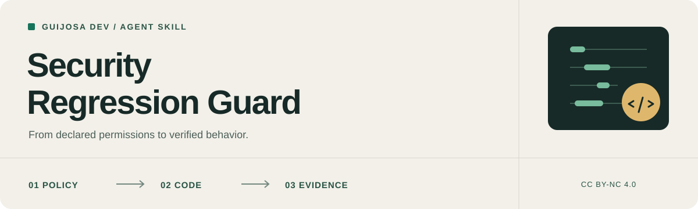

<p align="center">
  
</p>

<h1 align="center">Security Regression Guard</h1>

<p align="center">
  <a href="CHANGELOG.md"></a>
  <a href="LICENSE"></a>
  <a href="CONTRIBUTING.md"></a>
</p>

<p align="center"><a href="README.md" lang="es">Español</a> · <strong>English</strong></p>

<p align="center">
  Instructions that help your agent inspect permissions, trace actual side effects,<br>
  and verify changes through behavioral tests.
</p>

<p align="center"><strong>Codex · Claude Code · Antigravity · Cursor</strong><br>Markdown · No dependencies of its own · CC BY-NC 4.0</p>

<p align="center">
  <a href="#why-it-exists">Why it exists</a> · <a href="#installation">Install</a> ·
  <a href="#usage">Usage</a> · <a href="#contributing">Contribute</a> ·
  <a href="#versions-and-languages">Versions</a> · <a href="#license-and-commercial-use">License</a> ·
  <a href="#disclaimer">Disclaimer</a>
</p>

---

> [!IMPORTANT]
> **Read [the complete skill](security-regression-guard/SKILL.md) before installing it.** It contains instructions for an agent with the tools and permissions available in your environment. It does not enforce a security boundary or guarantee that a model follows every instruction. The installable skill is written in Spanish; this page is the English documentation.

## Why it exists

A hidden button does not block a direct request. Read access should not silently allow writes through another route. A test that fails because its input is invalid does not prove authorization works.

This skill grew out of my experience reviewing projects with AI agents and seeing the same mistakes recur. It turns those lessons into reusable guidance without relying on the original framework, provider or business domain.

The aim is to reduce omissions and ask for concrete evidence. **It has not been shown to equalize the capabilities of different models**, and it does not replace a professional security review.

## What it covers

| Area | Questions it takes to the code |
| --- | --- |
| **Roles and permissions** | Can read access write? Are inheritance, grants and denials distinct? Can a delegate modify superior privileges? |
| **Data isolation** | Are person, organization and ownership checked in details, reports, downloads and widgets? |
| **Sensitive operations** | Do imports, rule changes and alternate routes enforce the product's authorization and reauthentication policy? |
| **Integrity and side effects** | Does a calculation persist data? Do related IDs belong together? Can a partial failure leave inconsistent writes? |
| **Files and images** | Is actual content validated? Are stored bytes sanitized? Are access, replacement and orphaned files handled? |
| **Authentication and sessions** | Are expiry, revocation and account status enforced? Is credential storage appropriate to the architecture? |
| **Resource limits and configuration** | Are limits applied before expensive work? Are only known proxies trusted? Does a missing required safeguard fail safely? |
| **Tests and deployment** | Are valid requests from unauthorized actors tested? Are local checks distinguished from production verification? |

Apply relevant sections **within the task's scope**. An ordinary visual change should not automatically become a full application audit.

## How it works

1. **Understand the policy.** Identify who can do what and on which data without inventing business rules.
2. **Trace the operation.** Follow routes, validation, services, queries, files and background work through their effects.
3. **Fix within scope.** Preserve others' changes and distinguish authorized work from operations on live systems.
4. **Test both outcomes.** Unauthorized requests should fail without side effects; permitted requests should still work.
5. **Report evidence.** Explain the defect, fix, checks performed and remaining uncertainties.

## Installation

### With one command

With the files published on GitHub, run the [Skills CLI](https://www.skills.sh/docs/cli) from your target project. Node.js and Git must be available:

```bash
npx skills add elpeakyblinder/security-skill --skill security-regression-guard
```

With pnpm:

```bash
pnpm dlx skills add elpeakyblinder/security-skill --skill security-regression-guard
```

The installer downloads the material and lets you choose target agents; you do not need to clone the repository manually. `skills` is the installer, not a package published by this project.

To select an agent, add `--agent codex`, `--agent claude-code`, `--agent antigravity` or `--agent cursor`. For example:

```bash
pnpm dlx skills add elpeakyblinder/security-skill --skill security-regression-guard --agent codex
```

These examples install into the project. The CLI supports `--global` for personal installation; check its proposed destination because installer paths may differ from those used by your agent's current version. See the [installer options](https://github.com/vercel-labs/skills#options).

To list detected skills without installing:

```bash
pnpm dlx skills add elpeakyblinder/security-skill --list
```

The repository must contain the published files for remote installation to work. Installation does not change the [noncommercial license or separate commercial permission requirements](#license-and-commercial-use).

### Manual installation

Download the repository as a ZIP or clone it, read the instructions, then copy the complete `security-regression-guard` folder to a location recognized by your agent:

| Agent | Path within your project | Official documentation |
| --- | --- | --- |
| Codex | `.agents/skills/security-regression-guard/SKILL.md` | [Codex skills](https://learn.chatgpt.com/docs/build-skills) |
| Claude Code | `.claude/skills/security-regression-guard/SKILL.md` | [Claude Code skills](https://code.claude.com/docs/en/skills) |
| Google Antigravity | `.agents/skills/security-regression-guard/SKILL.md` | [Antigravity skills](https://antigravity.google/docs/skills) |
| Cursor | `.cursor/skills/security-regression-guard/SKILL.md` | [Cursor skills](https://cursor.com/docs/skills) |

Codex, Antigravity and Cursor can share the project's `.agents/skills/` location. Avoid duplicate installations of different versions with the same name. Preserve the `SKILL.md` filename and YAML header: copying `skillSecurity.md` under its standalone name does not install a discoverable skill. Manual installation needs no Node package, MCP server or plugin.

<details>
<summary><strong>Personal installation across projects</strong></summary>

| Agent | Personal destination folder |
| --- | --- |
| Codex | `~/.agents/skills/security-regression-guard/` |
| Claude Code | `~/.claude/skills/security-regression-guard/` |
| Google Antigravity | `~/.gemini/config/skills/security-regression-guard/` |
| Cursor | `~/.cursor/skills/security-regression-guard/` |

`~` means your user directory. On Windows, open `%USERPROFILE%` in File Explorer or use `$env:USERPROFILE` in PowerShell. Choose personal or project scope as needed. Personal files do not automatically transfer to remote machines, containers or agents.

</details>

<details>
<summary><strong>Check, update and remove</strong></summary>

Start an agent session and look for `security-regression-guard` in its skill selector. If absent, reopen the session and check the path and filename. Ask the agent which file it loaded and to summarize its scope before starting; this helps identify installation mistakes but does not prove compliance with every instruction.

Review differences and preserve your edits before replacing an installed folder. To uninstall, remove only `security-regression-guard` from the chosen location. Uninstalling does not reverse changes an agent already made to your projects.

</details>

Paths and invocation formats were checked against official documentation on **September 5, 2026**. A complete execution test in every agent has not been performed. Versions and environment policies can affect availability.

## Usage

In Codex CLI and its IDE extension, invoke `$security-regression-guard`; in the desktop app, use your version's skill selector. In Claude Code, use `/security-regression-guard`. In Antigravity and Cursor, mention the skill by name and verify it was loaded.

### Review before changing anything

```text
Use security-regression-guard to review authorization in the user module.
For now, do not modify files or data. Identify direct requests, alternate
routes and fields that could change roles or account states.
Report evidence-backed findings and a proposed test plan.
```

### Fix a specific boundary

```text
Use security-regression-guard to fix a read-only user being able to update
records. Inspect alternate routes for the same operation. Preserve the
existing policy and other people's changes. You may edit code and run
tests with isolated synthetic data. Verify rejection without side effects
and that authorized requests still work. Do not deploy or modify live data.
```

### Review a change before merging

```text
Use security-regression-guard to review this authentication diff.
Identify observable regressions, missing tests and configuration assumptions.
Separate verified findings from checks requiring the deployment environment.
Do not expand the scope without a concrete reason.
```

Installing the skill does not grant additional permissions or authorize live migrations, deployments, key rotations or changes to real accounts. English prompts can refer to the Spanish skill; that is not a claim of equivalent results across languages or models.

## Repository contents

| File or folder | Purpose |
| --- | --- |
| `README.md` / `README.en.md` | Spanish reference documentation and English translation |
| `security-regression-guard/SKILL.md` | Canonical, installable instructions |
| `skillSecurity.md` | Identical standalone reading copy |
| `CONTRIBUTING.md` | Contribution workflow and licensing of submissions |
| `SECURITY.md` | Private reporting of sensitive issues |
| `CHANGELOG.md` / `VERSION` | Change history and content version |
| `.github/` | Issue and pull request templates |
| `LICENSE` | Official CC BY-NC 4.0 legal text |
| `PUBLICAR.md` | Maintainer's publication guide, in Spanish |
| `assets/` | README artwork |

Keep both instruction copies in sync. Do not install them as separate skills.

## Contributing

**Contributions are welcome.** Report problems, suggest checks, improve translations or review pull requests. Read [CONTRIBUTING.md](CONTRIBUTING.md), create a fork and submit a PR targeting `main`; write access is not required. Issues and PRs in Spanish or English are welcome. Guijosa Dev reviews what gets merged.

[Suggest an improvement or report a bug](https://github.com/elpeakyblinder/security-skill/issues/new/choose) · [View pull requests](https://github.com/elpeakyblinder/security-skill/pulls) · [Report a security concern](SECURITY.md)

For behavioral issues, provide a synthetic example showing actual and expected decisions. Do not include secrets or client data. Use the private channel described in SECURITY.md when a report could expose real systems.

Contributions are offered under CC BY-NC 4.0, with the contributor retaining authorship. Submitting a PR does not automatically transfer copyright or grant additional commercial rights to Guijosa Dev. Commercial inclusion of third-party contributions requires separate agreement with their rights holders. No commercial CLA or signing bot is currently configured.

## Versions and languages

The content version is **0.1.0**, recorded in [VERSION](VERSION). See the [changelog](CHANGELOG.md) and [GitHub releases](https://github.com/elpeakyblinder/security-skill/releases). Tags identify specific revisions; `main` may advance afterward. Version numbers do not certify security.

Documentation is available in Spanish and English. The installable instructions remain in Spanish. Additional translations can be proposed through PRs and linked once complete and reviewed.

## License and commercial use

**© 2026 Guijosa Dev.** Original skill text, documentation and SVG artwork are offered under **[Creative Commons Attribution-NonCommercial 4.0 International](https://creativecommons.org/licenses/by-nc/4.0/)**. Read the [full license](LICENSE).

You may share and adapt the material for noncommercial purposes under the license: retain applicable attribution and notices, link the license and indicate changes. Granted permissions are not revoked while its conditions are met.

**Commercial use requires separate permission**, except where applicable law permits use without authorization. Contact **[devcharlying@gmail.com](mailto:devcharlying@gmail.com?subject=Commercial%20permission%20-%20Security%20Regression%20Guard)** with who will use it, the intended purpose and whether it will be redistributed or incorporated into a service. There is no automatic fee or revenue-sharing arrangement.

Noncommercial status depends on the purpose of the use; a free application or the absence of resale does not by itself settle that question. Clarify uncertain business or paid uses before adopting the material.

The license concerns copyrightable repository material. It does not claim ownership of your projects, general ideas or security techniques, and it does not automatically make every agent output the author's property. Third-party materials retain their own terms. This project is not presented as open-source software without commercial restrictions.

Suggested attribution, adapted to the medium:

> Security Regression Guard by Guijosa Dev (2026). [CC BY-NC 4.0](https://creativecommons.org/licenses/by-nc/4.0/). Source: [original repository](https://github.com/elpeakyblinder/security-skill). Changes: identify modifications, if any. Provided without warranties; retain the applicable disclaimer notice.

---

## Disclaimer

This skill was created by **Guijosa Dev** from personal experience reviewing projects and working with AI agents. It is shared as guidance. **Read and understand its instructions before use** and assess their suitability for your project, model, tools and environment.

The material is provided **as is and as available, without warranties**, to the maximum extent permitted by applicable law. It does not guarantee freedom from vulnerabilities, protection against attacks, regulatory compliance, accurate results or fitness for a particular purpose. It is not a professional security or legal service, audit or certification.

Models may misinterpret instructions, omit checks or perform inappropriate actions. Review changes and results, limit agent permissions and use isolated tests and backups appropriate to the risk. Do not test third-party systems without authorization.

**The person or organization using this skill is responsible, within their scope of action and control, for evaluating and deciding how it is used.** This includes selecting and configuring the agent, limiting its permissions, reviewing recommendations, validating proposed optimizations and changes, and deciding what to authorize, execute or deploy. Delegating work to an AI agent does not replace professional judgment or supervision. This statement does not automatically assign all legal liability to the user or exclude non-excludable liabilities of the author or third parties.

To the maximum extent permitted by applicable law, the author and contributors disclaim liability for damages or losses arising from use of, or inability to use, this material, including data loss, service interruption, security failures or consequences of actions performed by AI agents. **This exclusion does not apply where prohibited by law** and does not remove rights or liabilities that cannot legally be excluded.

This notice accompanies the license without changing its terms or imposing additional restrictions on rights it grants. Nothing in this repository guarantees legal immunity for its author, contributors or users. This English documentation does not amend the official license text.
