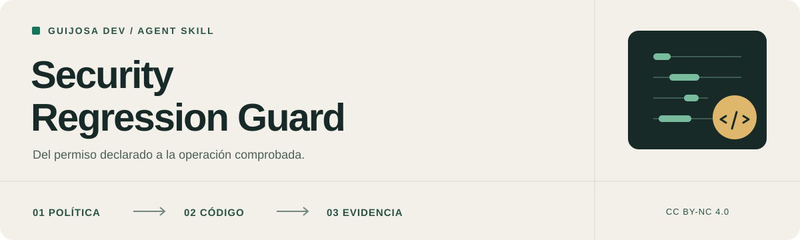

<p align="center">
  
</p>

<h1 align="center">Security Regression Guard</h1>

<p align="center">
  Instrucciones para que tu agente revise permisos, siga los efectos reales del código<br>
  y compruebe sus correcciones con pruebas de comportamiento.
</p>

<p align="center">
  <strong>Codex · Claude Code · Antigravity · Cursor</strong><br>
  Markdown · Sin dependencias propias · CC BY-NC 4.0
</p>

<p align="center">
  <a href="#por-qué-existe">Por qué existe</a> ·
  <a href="#instalación">Instalación</a> ·
  <a href="#cómo-usarla">Uso</a> ·
  <a href="#licencia-y-uso-comercial">Licencia</a> ·
  <a href="#aviso-de-responsabilidad">Aviso de responsabilidad</a>
</p>

---

> [!IMPORTANT]
> **Lee [la skill completa](security-regression-guard/SKILL.md) antes de instalarla.** Es texto que orienta a un agente con las herramientas y permisos de tu entorno. No añade una barrera de seguridad al sistema ni garantiza que el modelo siga todas sus instrucciones.

## Por qué existe

Un botón oculto no impide una petición directa. Un usuario con permiso de consulta no debería poder escribir mediante otra ruta. Una prueba que recibe un error por datos inválidos tampoco demuestra que la autorización funcione.

Esta skill nace de mi experiencia revisando proyectos con agentes de IA y de los errores que vi repetirse. Reúne esas lecciones en instrucciones reutilizables para otros proyectos, sin depender de su framework, proveedor o dominio de negocio.

La intención es reducir omisiones y pedir evidencia concreta. **No se ha demostrado que iguale las capacidades de distintos modelos**, ni que sustituya una revisión de seguridad profesional.

## Qué revisa

| Área | Preguntas que lleva al código |
| --- | --- |
| **Roles y permisos** | ¿Consultar permite también escribir? ¿Se distinguen herencia, concesión y denegación? ¿Puede un delegado modificar privilegios superiores? |
| **Aislamiento de datos** | ¿Se comprueban persona, organización y propiedad en detalles, reportes, descargas y widgets? |
| **Operaciones sensibles** | ¿Importaciones, cambios de reglas y rutas alternativas exigen la autorización y reautenticación definidas por el producto? |
| **Integridad y efectos** | ¿Un cálculo guarda datos? ¿Los IDs relacionados pertenecen al mismo recurso? ¿Un fallo intermedio deja escrituras parciales? |
| **Archivos e imágenes** | ¿Se valida el contenido real? ¿Los bytes almacenados están saneados? ¿Se controlan acceso, reemplazos y archivos huérfanos? |
| **Autenticación y sesiones** | ¿Se respetan expiración, revocación y estado de cuenta? ¿Las credenciales se almacenan según la arquitectura? |
| **Consumo y configuración** | ¿Hay límites antes del trabajo costoso? ¿Se confía únicamente en proxies conocidos? ¿Una protección ausente falla de forma controlada? |
| **Pruebas y despliegue** | ¿Se prueban peticiones válidas de actores sin permiso? ¿Se distingue lo verificado localmente de lo pendiente en producción? |

Los apartados se aplican **según el alcance de la tarea**. Corregir un cambio visual ordinario no debe convertirse automáticamente en una auditoría de toda la aplicación.

## Cómo trabaja

1. **Entiende la política.** Identifica quién puede hacer qué y sobre cuáles datos, sin inventar reglas de negocio.
2. **Traza la operación.** Sigue rutas, validación, servicios, consultas, archivos y tareas de fondo hasta sus efectos.
3. **Corrige dentro del alcance.** Conserva cambios ajenos y distingue trabajo autorizado de operaciones sobre sistemas reales.
4. **Prueba ambos lados.** La petición no autorizada debe rechazarse sin efectos; la permitida debe seguir funcionando.
5. **Entrega evidencia.** Explica el fallo, la corrección, las pruebas ejecutadas y las incertidumbres pendientes.

## Instalación

### Con un comando

Con los archivos publicados en GitHub, puedes instalarla desde la carpeta de tu proyecto usando el [CLI de Skills](https://www.skills.sh/docs/cli). Necesitas Node.js y Git disponibles:

```bash
npx skills add elpeakyblinder/security-skill --skill security-regression-guard
```

Si utilizas pnpm, el comando equivalente es:

```bash
pnpm dlx skills add elpeakyblinder/security-skill --skill security-regression-guard
```

El instalador descarga el material y permite elegir los agentes de destino. No necesitas clonar el repositorio manualmente. Esta skill no requiere un paquete propio en el registro de Node: `skills` es el instalador y `elpeakyblinder/security-skill` es el repositorio de origen.

Para elegir un agente directamente, añade `--agent codex`, `--agent claude-code`, `--agent antigravity` o `--agent cursor`. Por ejemplo:

```bash
pnpm dlx skills add elpeakyblinder/security-skill --skill security-regression-guard --agent codex
```

Estos ejemplos instalan en el proyecto. El CLI admite `--global` para instalación personal; comprueba el destino que propone, porque algunas rutas globales del instalador pueden diferir de las de la versión actual de tu agente. Las ubicaciones manuales se indican abajo. Consulta las [opciones del instalador](https://github.com/vercel-labs/skills#options).

Para consultar qué skills detecta sin instalarlas:

```bash
pnpm dlx skills add elpeakyblinder/security-skill --list
```

La descarga desde GitHub requiere que el repositorio ya contenga los archivos. Si todavía está vacío, primero debe publicarse el commit inicial. La instalación no modifica las condiciones de [uso no comercial y permisos comerciales separados](#licencia-y-uso-comercial).

### Instalación manual

Descarga el repositorio como ZIP o clónalo y lee sus instrucciones. Después, copia la carpeta **`security-regression-guard` completa** en una de estas ubicaciones del proyecto donde vayas a usarla:

| Agente | Ubicación dentro de tu proyecto | Documentación oficial |
| --- | --- | --- |
| **Codex** | `.agents/skills/security-regression-guard/SKILL.md` | [Skills en Codex](https://learn.chatgpt.com/docs/build-skills) |
| **Claude Code** | `.claude/skills/security-regression-guard/SKILL.md` | [Skills en Claude Code](https://code.claude.com/docs/en/skills) |
| **Google Antigravity** | `.agents/skills/security-regression-guard/SKILL.md` | [Skills en Antigravity](https://antigravity.google/docs/skills) |
| **Cursor** | `.cursor/skills/security-regression-guard/SKILL.md` | [Skills en Cursor](https://cursor.com/docs/skills) |

Codex, Antigravity y Cursor admiten la ubicación de proyecto `.agents/skills/`: pueden compartir una copia. Evita instalar versiones distintas con el mismo nombre en varias ubicaciones que lea un mismo agente.

**No necesitas un paquete de Node, servidor MCP ni plugin para esta instalación local.** Conserva el nombre `SKILL.md` y su cabecera YAML. Copiar únicamente `skillSecurity.md` con ese nombre no equivale a instalar una skill detectable.

<details>
<summary><strong>Instalación personal: disponible en varios proyectos</strong></summary>

En lugar de la carpeta del proyecto, puedes usar la ubicación personal del agente:

| Agente | Carpeta personal de destino |
| --- | --- |
| Codex | `~/.agents/skills/security-regression-guard/` |
| Claude Code | `~/.claude/skills/security-regression-guard/` |
| Google Antigravity | `~/.gemini/config/skills/security-regression-guard/` |
| Cursor | `~/.cursor/skills/security-regression-guard/` |

`~` representa tu carpeta de usuario. En Windows puedes abrirla con `%USERPROFILE%` en el Explorador; en PowerShell se consulta mediante `$env:USERPROFILE`.

Escoge instalación personal **o** de proyecto según el alcance que necesites. Las copias personales no se trasladan automáticamente a equipos, contenedores o agentes remotos.

</details>

<details>
<summary><strong>Comprobar, actualizar y desinstalar</strong></summary>

Después de copiarla, abre una sesión del agente y busca `security-regression-guard` en su selector de skills. Si no aparece, vuelve a abrir la sesión y comprueba la ubicación y el nombre del archivo.

Pídele al agente que indique qué archivo cargó y resuma su alcance antes de comenzar. Esa comprobación ayuda a detectar una instalación equivocada; no demuestra que todas las instrucciones se cumplirán.

Para actualizar, revisa las diferencias y conserva tus cambios antes de reemplazar la carpeta. Para desinstalar, retira únicamente la carpeta `security-regression-guard` de la ubicación elegida. Desinstalarla no revierte cambios que el agente ya haya realizado en tus proyectos.

</details>

Las rutas y formas de invocación se contrastaron con la documentación oficial el **5 de septiembre de 2026**. No se ha realizado una prueba completa de ejecución en cada agente. Las versiones y políticas de tu entorno pueden cambiar su disponibilidad.

## Cómo usarla

En **Codex CLI y su extensión**, puedes invocarla como `$security-regression-guard`; en la aplicación, usa el selector de skills disponible en tu versión. En **Claude Code**, usa `/security-regression-guard`. En Antigravity y Cursor, referencia la skill por su nombre y comprueba que se cargó.

### Revisar antes de cambiar

```text
Usa security-regression-guard para revisar la autorización del módulo
de usuarios. Por ahora, no modifiques archivos ni datos: identifica
peticiones directas, rutas alternativas y campos que permitan cambiar
roles o estados. Entrega hallazgos con evidencia y una propuesta de pruebas.
```

### Corregir una frontera concreta

```text
Usa security-regression-guard para corregir que un usuario de consulta
pueda actualizar registros. Revisa también las rutas alternativas del
mismo cambio. Conserva la política existente y los cambios ajenos.
Puedes modificar código y ejecutar pruebas con datos sintéticos aislados.
Comprueba el rechazo sin efectos y que el caso autorizado siga funcionando.
No despliegues ni modifiques datos reales.
```

### Revisar un cambio antes de integrarlo

```text
Usa security-regression-guard para revisar este diff de autenticación.
Identifica regresiones observables, pruebas ausentes y supuestos sobre
configuración. Distingue lo comprobado de lo que requiere validación
en el entorno de despliegue. No amplíes el alcance sin un motivo concreto.
```

Los ejemplos delimitan tareas distintas. Instalar esta skill no concede permisos adicionales al agente ni autoriza por sí mismo migraciones, despliegues, rotaciones de claves o cambios en cuentas reales.

## Contenido del repositorio

```text
.
├── README.md                          Presentación, instalación y condiciones
├── LICENSE                            Texto oficial de CC BY-NC 4.0
├── PUBLICAR.md                        Guía de publicación para el mantenedor
├── assets/
│   └── banner.svg                     Cabecera del README
├── skillSecurity.md                   Copia de lectura independiente
└── security-regression-guard/
    └── SKILL.md                       Fuente principal y archivo instalable
```

La fuente principal es **[`security-regression-guard/SKILL.md`](security-regression-guard/SKILL.md)**. [`skillSecurity.md`](skillSecurity.md) conserva el mismo contenido para lectura independiente. Si modificas las instrucciones, actualiza ambas copias; no instales las dos como skills diferentes.

## Aportaciones

¿Encontraste una omisión o una instrucción que produce una mala decisión? Describe el contexto mínimo, el comportamiento observado, el esperado y una prueba reproducible con datos sintéticos. Las mejoras deben conservar el enfoque generalista y el alcance autorizado por el usuario.

No incluyas credenciales, datos personales ni información privada de clientes. Si el hallazgo expone un sistema real, contacta primero por correo en lugar de publicar sus detalles en una issue.

Antes de incorporar una aportación a una edición comercial, se deberán acordar con su titular los derechos necesarios. Enviar una propuesta no transfiere automáticamente su autoría ni concede una autorización comercial adicional.

## Licencia y uso comercial

**© 2026 Guijosa Dev.** El texto de la skill y la documentación original se ofrecen bajo **[Creative Commons Atribución-NoComercial 4.0 Internacional](https://creativecommons.org/licenses/by-nc/4.0/deed.es)**. La cabecera SVG original se ofrece bajo la misma licencia. Consulta el [texto completo](LICENSE) y su [versión oficial en español](https://creativecommons.org/licenses/by-nc/4.0/legalcode.es).

Puedes compartir y adaptar el material para fines no comerciales cumpliendo la licencia: conserva la atribución y los avisos aplicables, enlaza la licencia e indica los cambios. Los permisos concedidos no se revocan mientras se cumplan sus condiciones.

**El uso comercial requiere un permiso separado**, salvo los usos para los que la ley no exige autorización. Para plantear tu caso y negociar condiciones, escribe a **[devcharlying@gmail.com](mailto:devcharlying@gmail.com?subject=Permiso%20comercial%20-%20Security%20Regression%20Guard)**. Incluye quién lo utilizará, para qué y si se redistribuirá o integrará en un servicio. No existe una tarifa ni un reparto de ingresos automático.

“No comercial” depende del propósito del uso; que una aplicación sea gratuita o que la skill no se revenda no basta para clasificarlo. Si tienes dudas sobre un uso empresarial o remunerado, acláralas antes de incorporarla.

Esta licencia se refiere al material protegible del repositorio; no reclama propiedad sobre tus proyectos, ideas generales o técnicas de seguridad. La restricción comercial no convierte automáticamente todo resultado de un agente en propiedad del autor. Los materiales de terceros conservan sus propios términos. Este proyecto no se presenta como software de código abierto sin restricciones comerciales.

Una forma de atribución que puedes adaptar al medio:

> Security Regression Guard, de Guijosa Dev (2026). [CC BY-NC 4.0](https://creativecommons.org/licenses/by-nc/4.0/). Fuente: [repositorio original](https://github.com/elpeakyblinder/security-skill). Cambios: indica los realizados, si los hay. Material sin garantías; conserva el aviso de responsabilidad aplicable.

---

## Aviso de responsabilidad

Esta skill fue creada por **Guijosa Dev** a partir de su experiencia personal revisando proyectos y trabajando con agentes de IA. Se comparte como material orientativo. **Lee y entiende sus instrucciones antes de utilizarla** y valora si son adecuadas para tu proyecto, modelo, herramientas y entorno.

El material se proporciona **tal cual y según disponibilidad, sin garantías**, en la máxima medida permitida por la ley aplicable. No garantiza ausencia de vulnerabilidades, protección frente a ataques, cumplimiento normativo, exactitud de los resultados ni idoneidad para un propósito concreto. Tampoco constituye una auditoría, certificación o asesoría profesional de seguridad o jurídica.

Los modelos pueden interpretar mal las instrucciones, omitir comprobaciones o ejecutar acciones inadecuadas. Revisa los cambios y resultados, limita los permisos del agente y utiliza pruebas aisladas y copias de seguridad según el riesgo. No ejecutes pruebas sobre sistemas ajenos sin autorización.

En la máxima medida permitida por la ley aplicable, el autor y los colaboradores excluyen su responsabilidad por daños o pérdidas derivados del uso o de la imposibilidad de uso de este material, incluidos pérdida de datos, interrupción de servicios, fallos de seguridad o consecuencias de acciones realizadas por agentes de IA. **Esta exclusión no se aplica cuando la ley no la permita** y no elimina derechos ni responsabilidades que no puedan excluirse legalmente.

Este aviso acompaña a la licencia y no modifica sus términos ni impone restricciones adicionales a los derechos que concede. Ningún aviso de este repositorio debe interpretarse como una garantía de inmunidad jurídica para su autor, colaboradores o usuarios.
